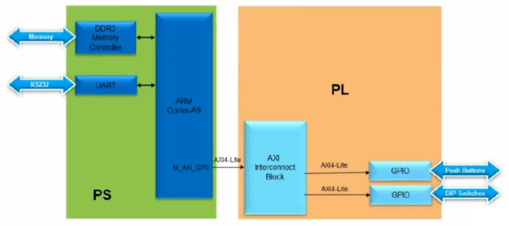
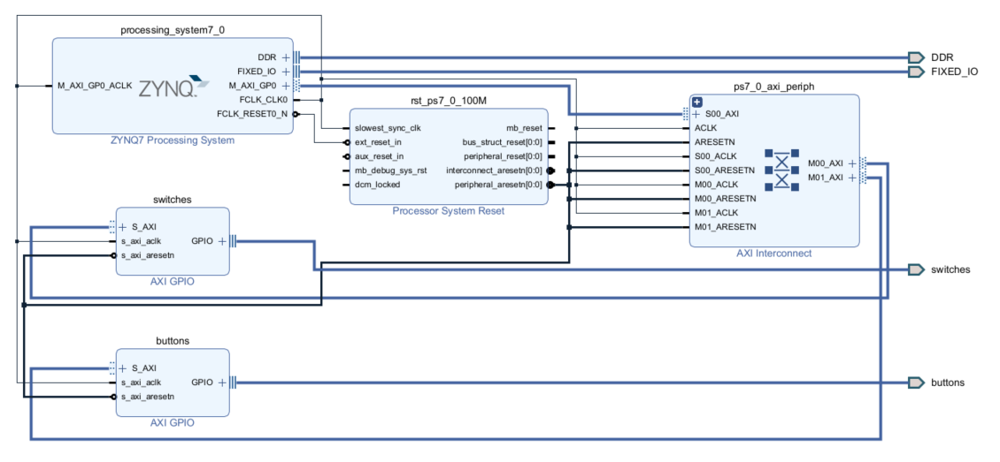
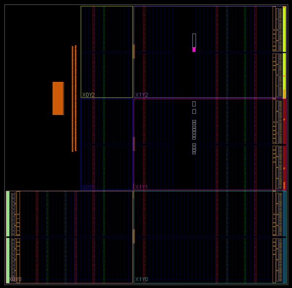
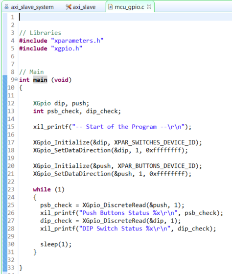
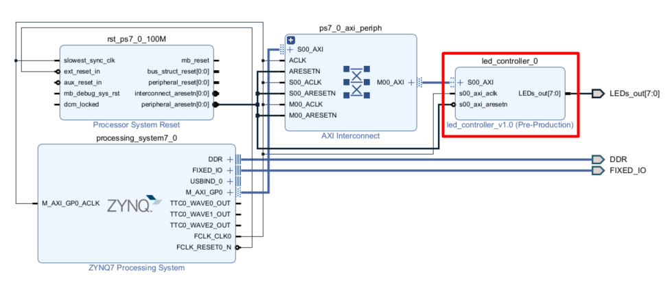
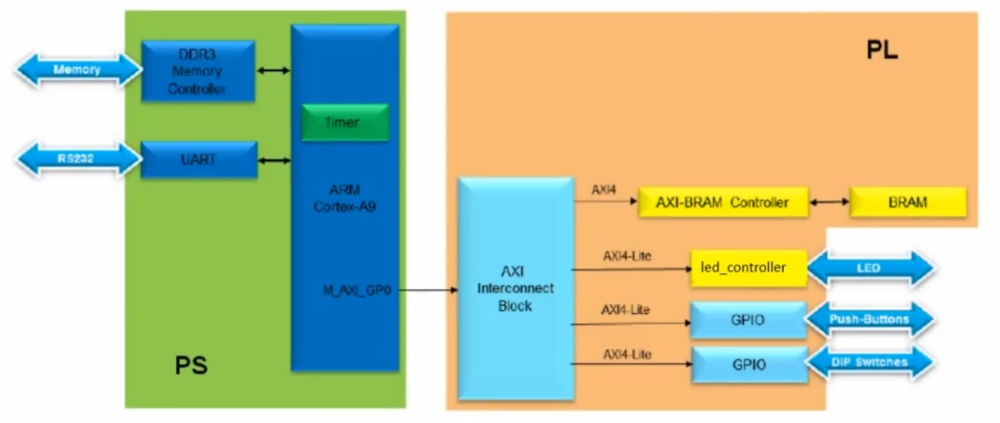
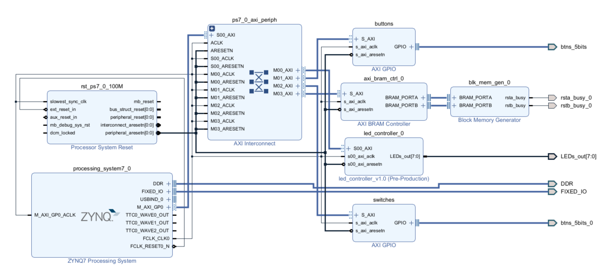

# Embedded System with ZedBoard

This project involves the building of AXI peripherals and the handling of GPIOs with a Xilinx ZYNQ FPGA placed on a ZedBoard.


## ZedBoard


## ZYNQ Schematic


## Buttons and Switches AXI GPIOs

Two AXI GPIO IPs where used for the driving of the onboard buttons and switches. The signals were associated with the corresponding pins using constraints. ARM Cortex-A9 MCU of ZYNQ was programmed using Xilinx SDK tool, and a custom script in C was








### Synthesis, Implementation and Bitstream Generation

The block design was wrapped, constraints were added and the synthesis, implementation and programming flow was followed. The post implementation device was generated:





### MCU programming

A custom C script was written for the programing of Cortex-A9 MCU. The purpose of the test was to read the buttons and switches values and print them in a local terminal:





## AXI LED Controller

An AXI GPIO IP was added in the block design and it was modified to have an 8-bit output for the led pins.



The MCU was again programmed using SDK, to set the value of the corresponding LEDs in a while loop.


## Timer and BRAM

The buttons and switches AXI GPIOs were added to the previous design, as well as an AXI BRAM Controller. The block memory is used to restore some information.






A software application was run on ARM Cortex-M9, aiming to the initialization of a timer and the update of the GPIO LEDs, whenever the timer expires.

```
   // Read dip switch values
   dip_check_prev = XGpio_DiscreteRead(&dip, 1);
   // Load timer with delay in multiple of ONE_TENTH
   XScuTimer_LoadTimer(TimerInstancePtr, ONE_TENTH*dip_check_prev);
   // Set AutoLoad mode
   XScuTimer_EnableAutoReload(TimerInstancePtr);
   // Start the timer
   XScuTimer_Start (TimerInstancePtr);
   while (1)
   {
	  // Read push buttons and break the loop if Center button pressed
	  psb_check = XGpio_DiscreteRead(&push, 1);
	  if(psb_check > 0)
	  {
		  xil_printf("Push button pressed: Exiting\r\n");
		  XScuTimer_Stop(TimerInstancePtr);
		  break;
	  }
	  dip_check = XGpio_DiscreteRead(&dip, 1);
	  if (dip_check != dip_check_prev) {
		  xil_printf("DIP Switch Status %x, %x\r\n", dip_check_prev, dip_check);
		  dip_check_prev = dip_check;
	  	  // load timer with the new switch settings
		  XScuTimer_LoadTimer(TimerInstancePtr, ONE_TENTH*dip_check);
		  count = 0;
	  }
	  if(XScuTimer_IsExpired(TimerInstancePtr)) {
			  // clear status bit
		  	  XScuTimer_ClearInterruptStatus(TimerInstancePtr);
		  	  // output the count to LED and increment the count
		  	  LED_CONTROLLER_mWriteReg(XPAR_LED_CONTROLLER_0_S00_AXI_BASEADDR, 0, count);
		  	  count++;
	  }
```

After initializing the timer, the main function reads the initial value of the dip switch and sets the timer's load value to be a multiple of ONE_TENTH based on the dip switch value. It then enables the timer to automatically reload and starts it. The main then enters an infinite loop, where it continually reads the value of the push button and the dip switch. If the push button is pressed, the timer is stopped and the loop is exited. If the dip switch value changes, the timer's load value is updated with the new dip switch value multiplied by ONE_TENTH, and the count variable is reset to 0. Finally, if the timer has expired, meaning the specified delay has passed, the main clears the timer's interrupt status, outputs the count to the LED controller, and increments the count variable. Overall, this script demonstrates the use of the PS timer on the ZYNQ-7000 SoC to create a delay and synchronize with other hardware peripherals, such as the dip switches and LED controller. The push button is used to stop the program and exit the loop.